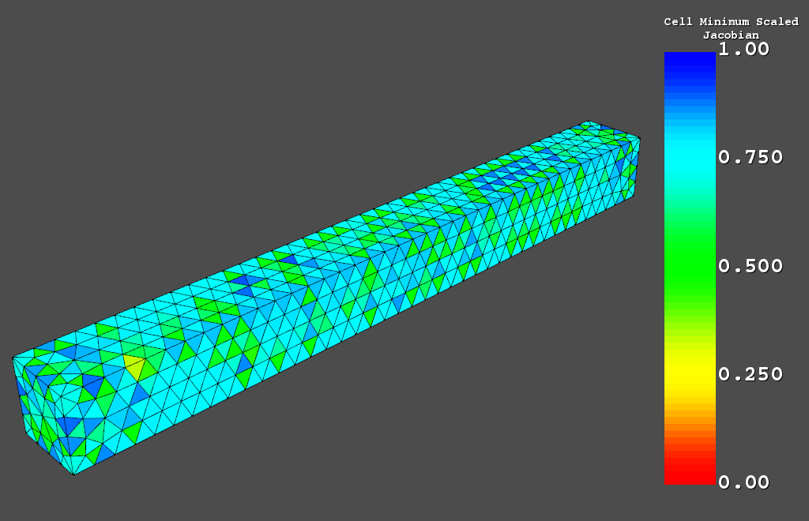

Compute Cell Quality
====================
Compute the minimum scaled jacoabian of a ``vtk.Unstructured.Grid``,
``pyvista.UnstructuredGrid``, or ``pyvista.StructuredGrid``.

Plot Cell Quality
~~~~~~~~~~~~~~~~~
This built-in example displays the minimum scaled jacobian of each
element of a tetrahedral beam:

.. code:: python

    from pyansys import examples
    examples.show_cell_qual()

This is the source code for the example:

.. code:: python

    import pyansys

    # load archive file and parse for subsequent FEM queries
    from pyansys import examples
    # archive = pyansys.Archive(examples.hexarchivefile)
    archive = pyansys.Archive(examples.tetarchivefile)
            
    # create vtk object
    grid = archive.parse_vtk(force_linear=True)

    # get the cell quality
    qual = grid.quality
    
    # plot cell quality
    grid.plot(scalars=qual, stitle='Cell Minimum Scaled\nJacobian', rng=[0, 1])

pyansys.quality
---------------
.. autofunction:: ansys.mapdl.reader.quality
